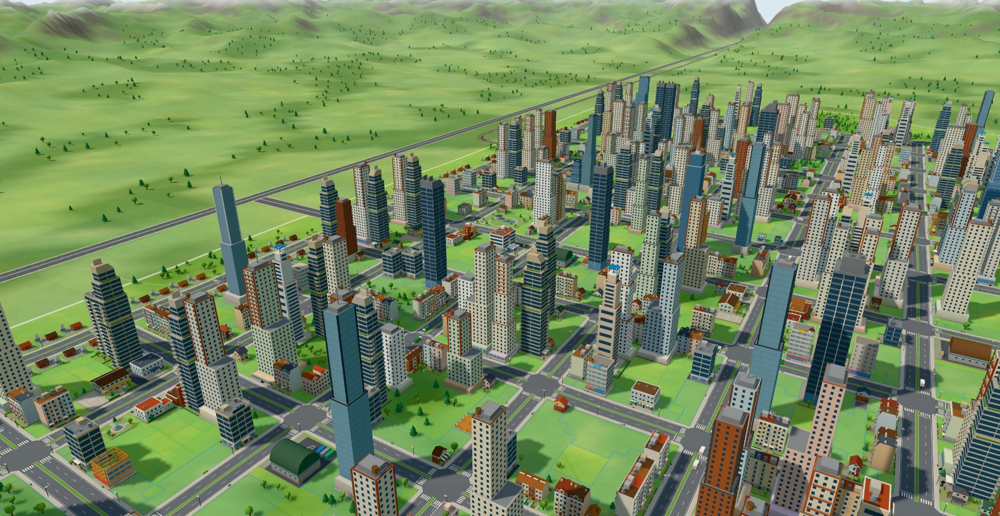
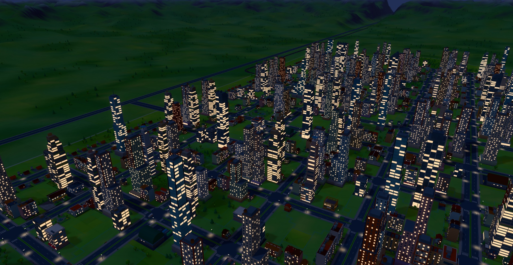

# Citybloom

An original 3D city-building game for the browser. Lay roads across a green valley, zone homes,
shops and industry, and keep the city powered, watered, safe, healthy and solvent while it grows
from a hamlet into a city of a hundred thousand. Residents are counted per building rather than
simulated one by one (each home knows how many live there, how many work or study and how happy they
are), but their trips are routed over the real roads: commuting, shopping and freight add up to the
traffic on every street, so jams form where the city sends them, and the cars, buses and walkers you
see follow samples of those trips. Trams and trains take people out of their cars, and freight trains
take the trucks off the roads. Fire engines, police cars, ambulances and garbage trucks drive to
each call. Pollution drifts on the wind; fires, earthquakes, tornadoes, floods and meteors test the
city from time to time.



The city is drawn bright, warm and toy-like: most buildings wear hand-made models (three in four
in a grown city), beside generated ones in the same style, each with lighter versions for the
distance; the sun crosses the sky through golden and blue hours, lit windows glow at night, grass
and trees turn with the seasons, and fields, kerbs, zebra crossings and benches make a grown city
read as a place. Graphics quality (High, Medium, Low)
switches each effect.



Built with TypeScript, Vite, Three.js and Preact. The hand-made building models were made for the
game (`assets/models/`, checked and converted at build time); the rest of the buildings, the icons
and the sounds are generated in code. There are no bought or borrowed assets (see `CREDITS.md` for
the open-source libraries).

## Play online

Once GitHub Pages is on for this repository (see the top of `PROGRESS.md`), every push to `main`
publishes the game at **https://pxwom6.github.io/CityBloom/**. It's an installable app: after one
visit it plays offline, your browser's install button (or Share → Add to Home Screen on iPhone and
iPad) puts it in a window of its own, and when a new version is out the game offers to reload into
it, saving your city first. Saves stay in your browser across updates; export them from the load
screen to keep a copy. On the first launch a quick check picks graphics that suit the device (a
lighter preset on older laptops); Settings shows the pick and can check again.

## Run it

Needs Node.js 20.19+ or 22.12+ and a browser with WebGL2.

```sh
npm install
npm run dev          # play at http://localhost:5173
```

To build a static copy you can host anywhere (it's plain files; saves live in the browser):

```sh
npm run build        # type-checks, then writes dist/
npm run preview      # serves dist/ at http://localhost:4173
BASE_PATH=/my-city/ npm run build   # for a site served from a subpath
```

The deploy workflow is `.github/workflows/deploy.yml` (unit tests, then a build with the Pages
path, then publish). The service worker (`sw.js`) is written by the build with every file it
produced, so any change makes a new version.

## Play

The main menu opens over a small town that keeps living in the background. Choose **New city**,
pick a map (river, coast, lakes or highlands, or one of your own from the map editor), a seed, a difficulty, and whether you want sandbox
money, random disasters or elections. The tutorial is on for your first city and walks through the basics:

1. **Roads** off the highway: drag to draw a straight road, or click point to point to keep going;
   the curve tool takes a start, a bend and an end, and the free tool follows the mouse. Over hills
   the ground is cut and filled so a road climbs no steeper than its type allows (streets 16 %,
   avenues 12 %, boulevards 8 %), with a viaduct across deep dips: the ghost shows the road at its
   built height, turning amber near the limit and red where it's too steep, and the hint gives the
   climb, the earthworks' cost, or what would fix it.
2. **Zones** beside them: residential, commercial and industrial. Buildings grow on their own when
   there's demand (the R, C and I bars in the top bar tell you what the city wants, and why).
3. **Power, water and sewage** from the Utilities menu. Homes without them empty out.
4. **Garbage, fire, police, health, schools and parks** as the town grows. The advisors say what's
   missing, and the data maps show where. Click a landfill to see whether its trucks keep up, and
   buy extra trucks there before you need a second landfill.
5. **Taxes and budget**: the budget panel shows every line of income and cost. Keep an eye on it.

**Traffic tools** in the road tool help once the town starts to queue. Junctions have their own
capacity, so a busy crossroads jams before its roads do: the **Roundabout** mode puts a ring on a
junction or a road (drag out to size it), and it passes far more traffic. The **One-way** mode turns
a road one way, round, or back (free), and **O** draws new roads one-way in the direction you draw;
a one-way road carries a quarter more. At 10,000 residents the **city highway** unlocks: four fast
lanes with no zoning or junctions, passing over the roads it crosses (or under a viaduct), joined to
them only by one-way **ramps** and to the regional highway where it ends. Click any road to inspect
its traffic, switch its direction, and add or remove a roundabout at its ends; the traffic map
shades junctions by their load and marks one-way roads and ramps with chevrons. Visible cars queue
behind each other, wait their turn at busy junctions and give way to cars already on a roundabout.

**Rail** unlocks at 5,000 residents. Pick **Railway** in the road tool and draw track anywhere (it
climbs gently and curves wide): across the middle of a street, avenue or dirt road it makes a level
crossing, and it bridges over boulevards and highways. Two **railway stations** on connected track
start a train line that shuttles between them; people walk further to catch a train than a bus and
like the ride, so a line beside a jammed road takes cars off it. The **Tram track** mode in the road
tool lays track along streets, avenues and boulevards (click a road, or drag along a route); a **tram
depot** on the track runs trams round the **tram stops** you place. The regional railway comes in at
the map's west edge: lay track from it to a **rail freight terminal** near your industry, and the
trucks that drove to the highway take their goods there to go on by train, while stations on track
joined to it bring the neighbours' commuters in by train. (A city from an older version whose edge was
built up may have no link: **Regional rail link** in the Transit menu lays one anywhere on the west
edge.) At level crossings the barriers come down as a train nears and cars wait for it; trams wait
for cars in their way, and cars for trams. Click a stop, a station, a
depot or the track to see its line, how often it runs and who rides it; the **Ridership** map shows
every line by how full it runs.

**Districts** (I, or the flag in the toolbar) are parts of the city you paint with a brush and name
(each takes its neighbourhood's name to start with). Most policies can be switched on for one
district instead of the whole city, and cost its share (by the people who live and work there) of
the city-wide price; a **high-rise ban** keeps one district low while the rest grows up. Two are for
districts only: a **heavy-traffic ban** sends lorries round it (if there's another way), and
**heritage** keeps it as it stands (nothing is rebuilt bigger, new buildings stay low or medium, and
its land is worth more). The Districts panel shows each one's residents, jobs, happiness, land
value, the taxes it pays and what its services and policies cost, and can show any data map for that
district alone.

**Seasons and weather.** A season is three months of the game's calendar, and a new city starts in
spring. Each map has its own climate (temperate by the river, mild and wet on the coast, hot summers
and snowy winters by the lakes, long alpine winters in the highlands), with clear days, cloud, rain,
thunderstorms, fog, snow and heatwaves. Grass and trees change with the seasons, from spring blossom
to autumn gold to bare branches, and snow settles on fields, roofs, trees and roads. The weather
matters: heating pushes power demand up in winter and heatwaves raise power and water use; snow
slows every car on the roads it lies on until it melts or a **public works depot** (Garbage and snow
bar) sends ploughs out; heavy rain raises the river and, with disasters on, can flood homes by the
water; dry spells lower what groundwater pumps give; and parks see fewer visitors in the rain. The
date in the top bar shows the weather, the temperature and the season, and opens a panel saying what
the weather is doing to the city. Settings turn seasons off or set the weather from off to wild, and
photo mode can pick any season and weather for a shot.

**The region.** Three neighbouring towns lie beyond the map, each with a character (an industrial
town, a commuter suburb, a resort) and fortunes of its own. Their people drive in along the highway,
or come by train to a station on the regional line, to take jobs your residents can't fill and to
shop; your residents without work take jobs there; and the region panel (the towns button in the top
bar, Shift+N) signs deals to buy or sell power, water and garbage processing, paid for what actually
comes through. Past 10,000 residents a **seaport** on deep water puts the city's goods on ships and
brings ferry passengers; past 20,000 an **airport** flies visitors and business travellers in, loud
along its runway (see the noise map). Visitors now arrive by road, train, air and sea and drive
through town to the sights; the region traffic map shows where they and the commuters go.

**Terrain and maps.** The terrain tool (the hill in the toolbar, Shift+T) raises, lowers, levels
and smooths the ground with a round brush, paid for by the cubic metre: level a hillside before
building on it and far more of its lots can be built on, or cut a pass through a ridge for a road.
Roads and buildings hold the ground they stand on, water is left alone, and a drag undoes in one
step. The **map editor** (from the main menu) makes maps of your own: start from a generated map or
flat meadow, sculpt hills and valleys, paint rivers, lakes and sea, plant forests, lay ore and oil,
say where the highway and railway come in and pick the climate. A playability check says whether a
first town has room by the highway (and what to fix if not); playable maps appear on the new-city
screen under your own maps, and any map exports as a `.citymap` file to share and opens from one.

New buildings, services, policies and landmarks unlock as the population passes each milestone.
Later on, a city can specialise in tourism, trade or technology, and mine ore or pump oil where the
ground holds them.

**Big projects** (the crane in the toolbar) open at 20,000 and 40,000 residents: a city stadium, a
solar tower array, a convention centre, a garden expo and a launch complex. Each has requirements
(population, and for some an educated workforce, a hotel, a research park or visitors), is built in
stages over months that you watch rise on site, pays for each stage as it starts (the site waits,
and says so, if the treasury can't) and gives a lasting perk once open: match days that fill the
city with visitors and the roads with fans, clean power, trade and research, tourism. The
inspector follows the build.

**Elections** come every four years and are won mostly on approval. In the six months before a
vote, the city panel's Election tab (P) lets you make up to two promises (cut crime, open a
hospital, shorter commutes, cleaner air, jobs for all, no tax rises), each judged on the day against
where the city stood when you made it. A win brings the region's grant and a year's goodwill; a
loss never ends the game, but the council blocks tax rises and new loans for a year. There are
none in sandbox, and Settings can switch them off.

**Scenarios** (from the main menu) are fourteen set challenges, each a ready-made city with goals, limits
and a time limit: grow a town to 10,000 on clean power alone, pay off a spendthrift mayor's loans,
win back a town before it votes, open a stadium without borrowing, untangle a gridlocked town,
unjam a town that queues at one crossroads, put an ironworks' freight on the train, clear the smoke
from a mill town, rebuild a lake town's waterworks after a flood, turn a coastal town into a
resort, keep the lorries out of an old market street, see an alpine town through its first
hard winter, keep a harbour town lit while opening it to the sea, and cut a hill town a way through
its ridge. Each opens with a brief; the city's name in the top bar opens its goals (G),
showing each against its target and the time left. Goals are checked as each month closes. A win
earns one to three stars (the card says what the second and third ask for), kept on this device;
win or lose, the city plays on.

**City history** (Y, or the chart button in the top bar) charts the city's life month by month:
population, approval, jobs and unemployment, the treasury, income and spending, air pollution, crime
and commute times, with milestones and disasters marked on the timeline. **Photo mode** (K, or the
camera at the end of the toolbar) hides the interface and lets the camera come down to eye level;
set the time of day, field of view, depth of field, tilt-shift and one of six colour grades, ride
along with a car, bus or passer-by, and save a PNG at up to twice the screen's resolution.

### Controls

| Action | Mouse | Trackpad | Keys |
| --- | --- | --- | --- |
| Pan | drag with the left button (when the tool doesn't use it) or middle button; screen edge (setting) | swipe with two fingers | W A S D / arrow keys |
| Rotate and tilt | drag with the right button | Option (Alt) or Shift + two-finger swipe; rotate gesture | Q / E rotate, R / F tilt |
| Zoom | wheel | pinch | + / − |
| Road tool | | | T |
| Road modes: straight, curve, free, upgrade, one-way, roundabout, tram track | road options | | Tab |
| Draw one-way roads, grid snap | road options | | O, G |
| Zone residential / commercial / industrial / dezone | | | Z / X / C / V |
| Bulldoze | | | B |
| Terrain: raise, lower, level, smooth | toolbar hill | | Shift+T, Tab, [ ] brush size |
| Districts: paint, erase, and their panel | toolbar flag | | I, [ ] brush size |
| Weather, season and what they're doing to the city | the date in the top bar | click | |
| Select and inspect | click a building, car, walker, road, railway or stop | click | H |
| Move a civic building | select it, then Move | | |
| Cancel, leave a tool, close a panel, pause menu | right click | | Escape |
| Undo / redo (last 30 actions) | toolbar | | ⌘Z / ⇧⌘Z on a Mac, Ctrl+Z / Ctrl+Shift+Z or Ctrl+Y elsewhere; U / Shift+U |
| Pause / speeds | top bar | | Space, 1, 2, 3 |
| Budget / advisors / notifications / city (progress, policies, election, achievements) | top bar | | M / J / N / P |
| City history | top bar | | Y |
| Region: neighbours, deals, commuters and visitors | top bar towns button | | Shift+N |
| Scenario goals | the city's name in the top bar | | G |
| Photo mode (H hides its panel, Enter saves, Esc leaves) | toolbar camera | | K |
| Data maps | toolbar | | L toggles the power map |
| Every shortcut on one card | | | ? |
| Debug panel (FPS, cheats) | | | backtick |

The game tells a trackpad from a mouse by what it sends; Settings → Pointing device fixes it to
one or the other. Undo reaches back 30 actions (building, zoning, bulldozing, road changes, moves)
and gives the money back; if something has grown on top since, it says so instead.

In the map editor the brushes take [ ] for size and , . for strength, and holding the button keeps
a brush working; its bar has the map's name and climate, the check, save, export and play.

The pause menu (Escape) has save, load, settings (graphics quality, shadows, draw distance,
interface size, pointing device, volumes, edge scrolling, disasters, elections, autosave) and export/import of `.citybloom`
save files. The city autosaves every few minutes.

## Develop

```sh
npm run typecheck && npm run lint && npm test && npm run e2e   # everything
npm test             # unit and scenario tests (Vitest)
npm run e2e          # end-to-end tests through the real UI (Playwright), with screenshots,
                     # against a production-mode build served from /CityBloom/ as on Pages
npm run soak         # ten minutes of top-speed play with disasters; fails on any console error
npm run bench        # sim tick timing (add --big for a ~100k-resident city)
npm run balance      # scripted players over 20 game years: careful, greedy, neglectful
npm run models:check # check every hand-made model in assets/models against its spec
```

Frame times on real hardware come from `scripts/dev/framebench.mjs` (a headed Chrome window with the
frame cap off; see `CLAUDE.md`).

The simulation is pure, deterministic TypeScript running in a Web Worker (`src/sim`); the page
renders a mirror of it (`src/client`, `src/render`) and every player action is a command, so the
same seed and commands always give the same city. Balancing numbers live in `src/data`.

- `SPEC.md`, `SPEC-2.md`, `SPEC-3.md`: the briefs (the game, phase 2's features, phase 3's graphics).
- `docs/models/PROMPTS.md`: the model spec and a prompt for every building.
- `DESIGN.md`: the technical design (architecture, simulation model, rendering, saves).
- `PROGRESS.md`: where things stand, known issues, performance numbers and ideas for what's next.
- `docs/DECISIONS.md`: the design calls made along the way, one line each.
- `docs/SPEC_REVIEW.md`: every item in the brief and where it's done.
- `CLAUDE.md`: working notes, dev scripts and gotchas.
